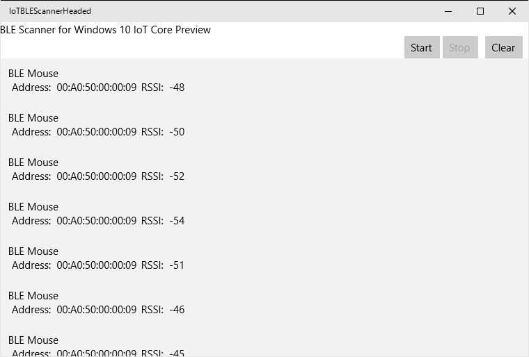

# Win10IoTBLEScanner
BLE advertisement scanner on Windows 10 IoT Core

## Requirements
* Visual Studio 2015 RC
* RPi2 with Windows 10 IoT Core
	- or A Windows 10 TP installed device
* An USB Bluetooth dongle which supports Bluetooth Low Energy
	- Confirmed with a dongle which uses Broadcomm BCM20702 chip.

## Run Application From Visual Studio
* Connect a RPi2 to local network.
* Open the property page of IoTBLEScannerHeaded in VS2015.
* Select "ARM" in the Solution platform dropdown listbox.
* Select *Debug* tab and set "Target device" to "Remote computer."
* Input the computer name of the RPi2 to the "Remote machine:" text box.
* Uncheck the "Use authentication" checkbox.
* Press "F5" or select "Debug - Start debug"

## Usage
* Press the "Start" button on the upper-right corner in the screen.
* Turn on a BLE device and make it advertising state.
* A list of advertisements will be shown.

